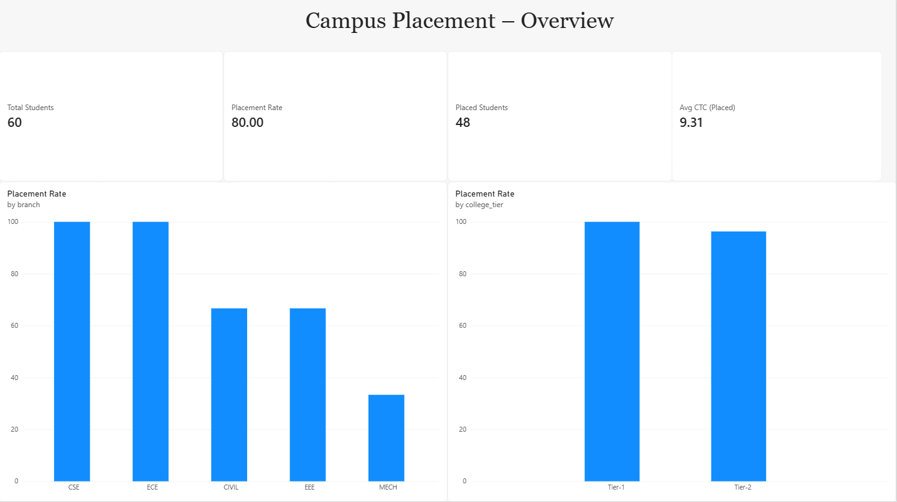
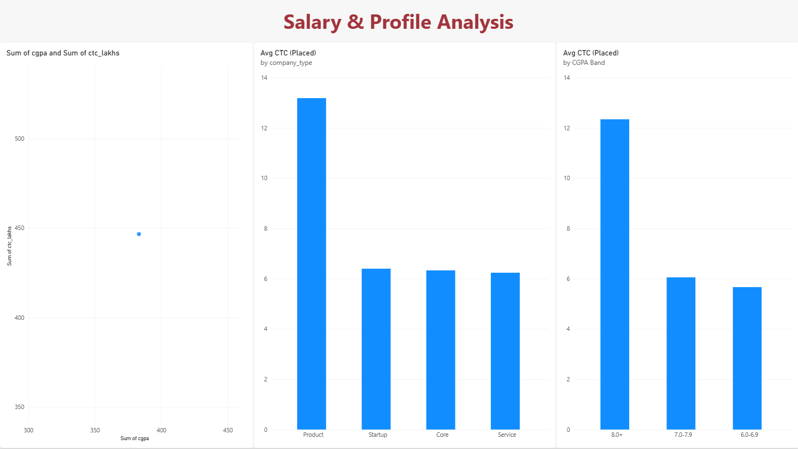
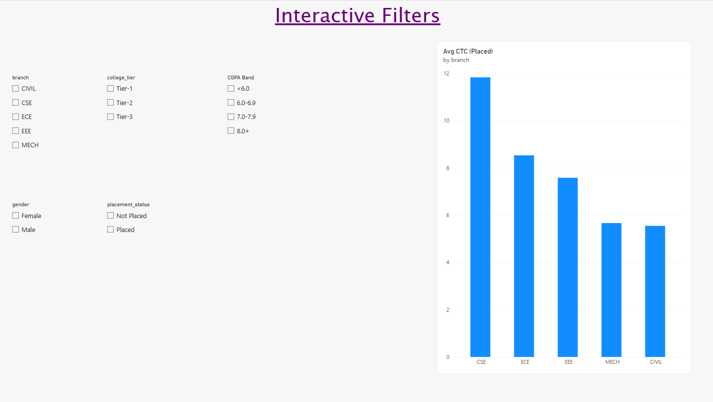

# Campus Placement Intelligence Analytics

End-to-end data analyst project analyzing campus placement data to derive insights on placement rates, salary trends, and key student attributes. Built with **Python**, **SQL**, **Excel**, and **Power BI**.



## 🎯 Objective

To analyze historical campus placement data and provide actionable insights for:
- College placement cells
- Students planning their skill development
- Recruiters understanding candidate profiles

Key questions addressed:
- What is the overall placement rate and how does it vary by branch, college tier, and CGPA?
- What factors influence salary packages (CTC)?
- Are there disparities in placement outcomes by gender or category?
- Which skills/certifications are associated with higher salaries?

## 📁 Repository Structure

```text
Campus Placement Intelligence Analytics/
│
├── README.md
├── data/
│   └── placements_data.csv
├── python/
│   └── analysis.py
├── sql/
│   └── placement_analysis.sql
├── powerbi/
│   └── placement_dashboard.pbix
├── excel/
│   └── placement_analysis.xlsx
└── screenshots/
    ├── dashboard1.png
    ├── dashboard2.png
    └── dashboard3.png
```

## 🗂️ Dataset

**File:** `data/placements_data.csv`

The dataset contains simulated but realistic campus placement records with the following columns:

- `student_id`: Unique student identifier  
- `name`: Student name  
- `gender`: Male / Female / Other  
- `category`: General / OBC / SC / ST  
- `branch`: e.g., CSE, ECE, MECH, CIVIL, EEE  
- `college_tier`: Tier-1 / Tier-2 / Tier-3  
- `cgpa`: Cumulative GPA (0–10)  
- `internships`: Number of internships completed  
- `certifications`: Number of relevant certifications  
- `skills`: Comma-separated list of skills (e.g., Python, SQL, Java)  
- `placement_status`: Placed / Not Placed  
- `company_type`: Product / Service / Startup / Core  
- `ctc_lakhs`: Cost to Company in lakhs per annum  
- `location`: Job location (e.g., Bangalore, Hyderabad, Pune, Remote)  

> Note: This is a synthetic dataset created for learning and portfolio purposes. It mimics real-world campus placement data structures.

## 🧪 Analysis Workflow

### 1. Data Understanding & Cleaning (Python)

- Load and inspect the dataset
- Handle missing values and inconsistent entries
- Create derived features (e.g., CGPA bands, skill counts)
- Perform exploratory data analysis (EDA)

**File:** `python/analysis.py`

### 2. SQL Analysis

- Load cleaned data into a database (e.g., SQLite / PostgreSQL)
- Write queries to answer key business questions:
  - Placement rate by branch and college tier
  - Average CTC by category and gender
  - Top skills associated with high salary packages

**File:** `sql/placement_analysis.sql`

### 3. Excel Reporting

- Build pivot tables for:
  - Placement rate by branch
  - Average CTC by college tier and CGPA band
- Create summary charts for quick stakeholder views

**File:** `excel/placement_analysis.xlsx`

### 4. Power BI Dashboard

- Import data and create a star schema (if needed)
- Build KPIs:
  - Overall placement rate
  - Average CTC
  - Total students analyzed
- Visualizations:
  - Placement rate by branch and college tier
  - CTC distribution by company type
  - CGPA vs CTC scatter plot
  - Skill-wise average salary
- Interactive slicers:
  - Branch, college tier, CGPA category, gender, placement status

**File:** `powerbi/placement_dashboard.pbix`  
**Preview:** See `screenshots/` folder.

## 📊 Key Insights (Example)

> These are example insights; exact numbers depend on the dataset version.

- **Placement Rate:** Overall placement rate is around 70–80%, varying significantly by branch and college tier.
- **Branch Impact:** CSE and ECE show higher placement rates and average CTC compared to MECH and CIVIL.
- **CGPA Effect:** Students with CGPA ≥ 8.0 have notably higher placement probability and salary packages.
- **Skills Matter:** Students with skills like Python, SQL, and Data Analysis tend to secure higher CTCs, especially in product companies.
- **Internships & Certifications:** More internships and relevant certifications correlate with better placement outcomes.

## 🚀 How to Reproduce This Project

### Prerequisites

- Python 3.8+ with `pandas`, `numpy`, `matplotlib`, `seaborn`
- A SQL database (SQLite is sufficient)
- Microsoft Excel
- Power BI Desktop

### Steps

1. **Clone the repository**
   ```bash
   git clone https://github.com/bhanugampala99-svg/Campus-Placement-Intelligence-Analytics.git
   cd Campus-Placement-Intelligence-Analytics
   ```

2. **Run Python analysis**
   ```bash
   cd python
   python analysis.py
   ```
   This will:
   - Load `data/placements_data.csv`
   - Clean and preprocess the data
   - Generate summary statistics and plots

3. **Run SQL queries**
   - Load the cleaned CSV into your database.
   - Execute queries from `sql/placement_analysis.sql`.

4. **Explore Excel file**
   - Open `excel/placement_analysis.xlsx` to see pivot tables and charts.

5. **Open Power BI dashboard**
   - Open `powerbi/placement_dashboard.pbix` in Power BI Desktop.
   - Refresh data if needed (point to `data/placements_data.csv`).

## 📸 Dashboard Screenshots

  
*Overview KPIs and placement rate by branch.*

  
*CTC analysis by company type and CGPA.*

  
*Interactive filters and skill-wise salary insights.*

## 🧠 Skills Demonstrated

- Data cleaning and preprocessing (Python, pandas)
- Exploratory data analysis and visualization
- SQL querying for business analytics
- Excel pivot tables and reporting
- Power BI data modeling and dashboard design
- Storytelling with data and business insights

## 📄 License

This project is for educational and portfolio purposes.  
You are free to use the code and structure for your own learning and portfolio projects.

## 🙌 Acknowledgements

- Dataset is synthetic, inspired by typical campus placement records.
- Project structure and best practices inspired by real-world data analytics portfolios and tutorials.
